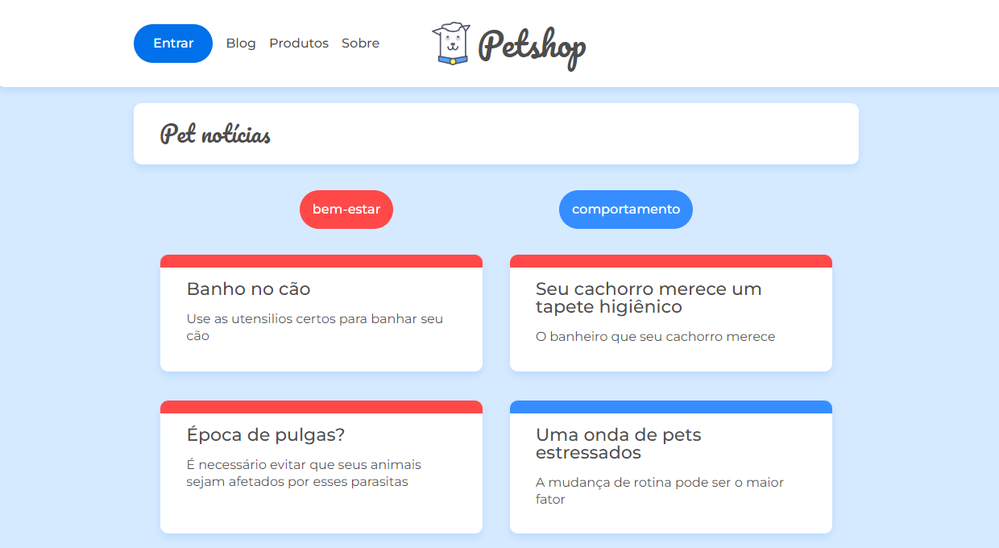

<h1 align="center">
  
</h1>

# React router: navegação spa

## Tarefas executadas

- Criado a página 404 (Não encontrada)
- Criado o componente de cabeçalho
- Criado rotas das páginas no App.js
- Criado roteamento para as páginas no cabeçalho

- Utilizado o json-server para simular uma api.
- Utilizado a biblioteca axios para fazer requisições no servidor para buscar posts.
- Criado um componente para listar os posts recebidos da requisição.
- Criado um componente para exibir um post específico, passando o id dele.
- Adicionado o redirecionamento da página para 404 ao não conseguir carregar um post específico.
- Filtrar posts por categorias
- Filtrar posts por subcategorias.

## Aprendizagem

React-Router-Dom é um pacote react para a manipulação de rotas.

O curso apresentou a versão 5.2.0 deste pacote, mas neste projeto, existe algumas modificações para a versão 6.2.1.

O BrowserRouter é um componente responsável por informar à aplicação que teremos um roteamento de componentes.

O antigo Switch era um componente que renderizava apenas o primeiro filho Route com o caminho correspondente, na versão 6, foi substituído por Routes.

O Route associa a rota ao component.
Nele temos os parâmetros element e path, na versão 5.2.0, usávamos parâmetros diferentes (path, exact e component).

O Link permite navegar entre páginas ao informar no parâmetro 'to' qual o nome da rota que será acessada pela URL

A MPA (multiple page application) trabalha de maneira tradicional, ou seja, a aplicação faz uma requisição ao servidor a cada página que precisa ser carregada.

A SPA (single page application) faz apenas uma requisição, recebe os arquivos que precisa do servidor, mas o responsável por gerenciar o que será exibido na aplicação são os componentes javascript.

JSON Server é uma biblioteca usado para criar um webservice REST JSON,
simulando uma API.
Para isso, precisamos apenas subir um arquivo json como banco de dados através do comando `npx json-server --watch db.json --port 5000`.

O useParams é um hook usado para extrair parâmetros da url do navegador.

O useHistory era um hook usado na versão 5 e foi substituído pelo useNavigate a partir da versão 6, e foi usado para redirecionar o usuário em determinada rota.
A versão 5 usava-se um objeto com algumas propriedades: `history.push('/home')` e a versão 6 se usa uma função: `navigate('/home')`.

O useRouteMatch era um hook utilizado, que retornava um objeto com as propriedades url e path.

A url retorna valores dos parâmetros de URL preenchidos, geralmente usada para serem usados na propriedade to do componente Link.
O path contém um caminho dinâmico com parâmetros de URL, geralmente são usados com o componente Route.

No curso, o path foi apresentado para criar um caminho relativo até a subcategoria.

Usando a versão 6 do react-router-dom, usamos o `*` no final do caminho da rota pai,ou seja, na rota de categorias para que as rotas descendentes fossem reconhecidas, tirando a necessidade de adicionar o path nos componentes Route e Link.
